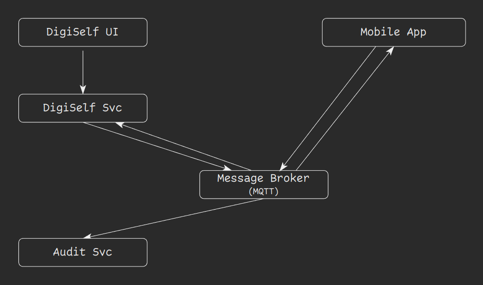

# EDA Sample: Passwordless Authentication w/ MQTT

This is a sample of an Event-Driven Architecture (EDA) that implements a user identity system (called DigiSelf) and leverages events through MQTT protocol. And all of these are showcased using a passwordless authentication flow.

status: WIP

 

## Architecture

The following concepts are taken from C4 Model terminology:
- _System Context_ is the whole context (space) in which the system performs.
- _Container_ represents a service that is part of the architecture (and its deployment).

### System Context

### Containers

In this case, we (will) have:

| container      | description |
| -------------- | ----------- |
| `gmqtt`        | A snapshot of [gmqtt](https://github.com/DrmagicE/gmqtt) (commit 9b6e597). |
| `digiself_svc` | The back-end side of DigiSelf. |
| `digiself_ui`  | The front-end side of DigiSelf. |
| `audit_svc`    | The audit service that captures and store the user relevant and related sensitive actions. |

 
